---
Azure Machine Learning Hackathon
---

#Objective:


Objective of this hackathon is to familiarize you with Azure ML looking at a
basic linear regression problem. The first day we will familiar ourselves with
the tools using Azure ML R SDK. On the 2nd day we will move towards using the
python SDK, and look at Auto ML.

The R SDK is in preview, which means it is not intended for production use,
however, this hackathon will provide an introduction into Azure ML leveraging R,
and then applying same concepts in python showcasing AutoML capabilities.

\-Connecting to a Workspace

\-Working with Datasets

\-Leveraging AML Compute

#References:


<https://github.com/Azure/MachineLearningNotebooks/tree/master/how-to-use-azureml>

<https://azure.github.io/azureml-sdk-for-r/reference/index.html>

<https://pypi.org/project/azureml-sdk/>

Steps after this hackathon:
---------------------------

\-Work with your team to setup a dev environment with custom roles based on your
business needs and the roles within your teams.

\-Productionizing Code

\-Building Azure ML Pipelines

Day 1:   R & Azure ML Workspace 9-2
-----------------------------------

>   1. Introductions 9-9:30

>   2. Workspace overview Import Notebook 9:30-10:00

>   2. Connecting to workspace in RStudio 10:00-10:30

>   3. Loading Data 10:30-11:00

>   4. Creating Compute Resources 11:00-11:30

>   *Lunch 11:30-12:30*

>   5. Training – Experiments & Runs 12:30-1:00

>   6. Deploying & Testing a model 1:00-2:00

 

Day 2: Python & Auto ML
-----------------------

1.  Auto ML through Designer 9:00-10:00

2.  Connecting to workspace in Jupyter Notebook, Loading Data, Creating Compute
    Resources 10:00-11:30

>   *Lunch 11:30-12:30*

1.  Deploying & Testing best model

2.  Training Auto ML Notebook– AutoML

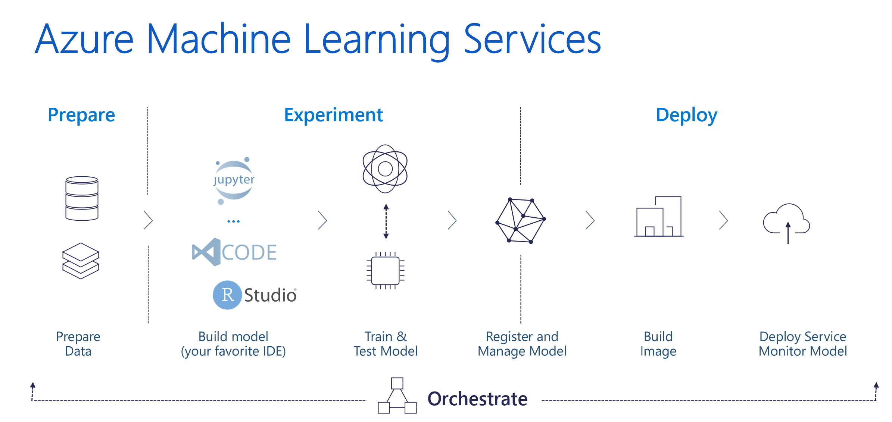

The Workspace

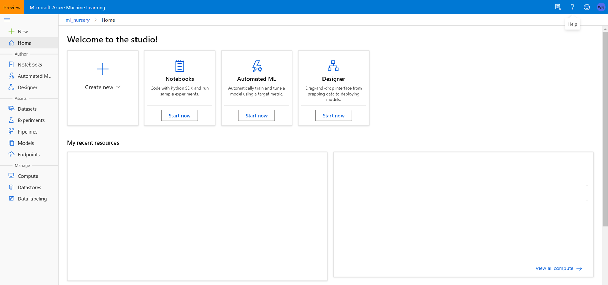

1.  Let’s get into the workspace with the link provided.

    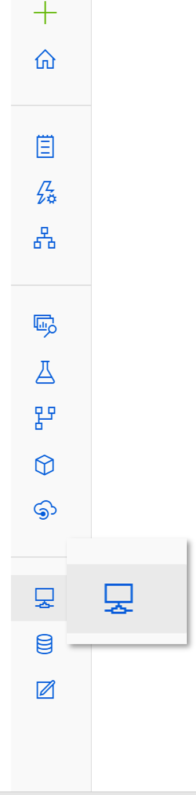

    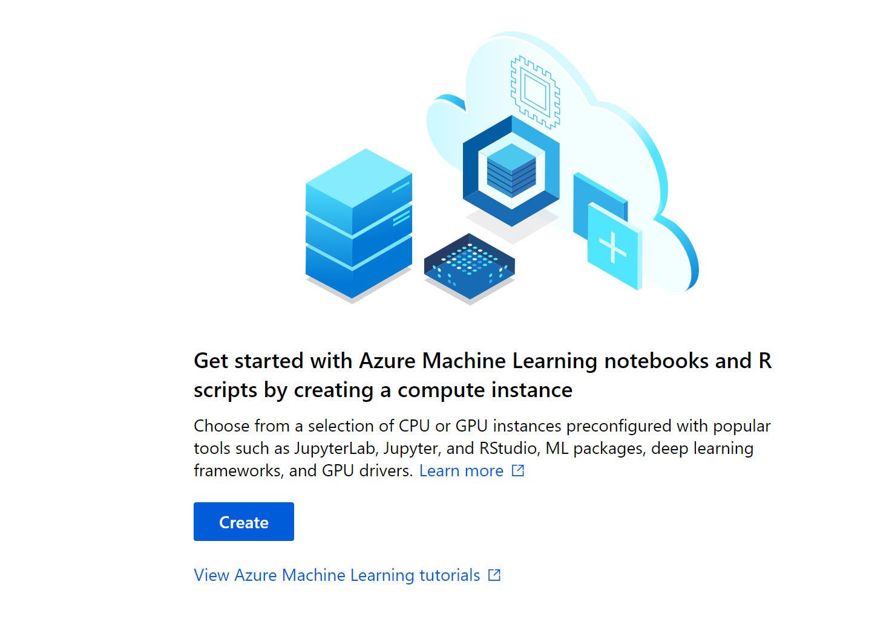

    Let’s click on the create button.

    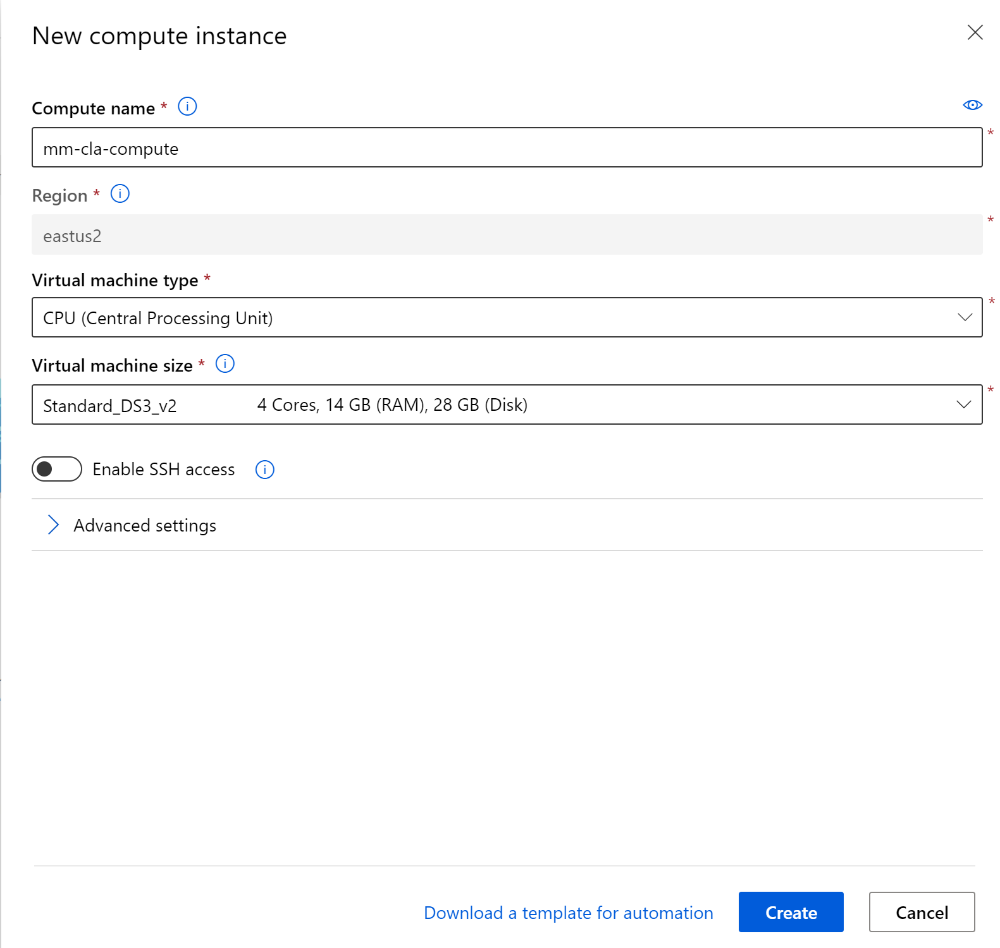

Let’s get the source files.

If you navigate to the notebooks, we are able to leverage git and clone the
resources which will then be available to our compute cluster.

Click on the git icon and let’s clone our notebooks


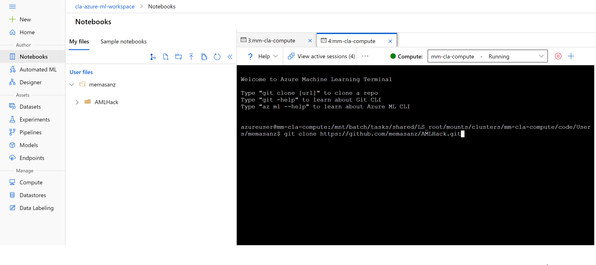

```
git clone https://github.com/memasanz/AMLHack.git
```

Now that the notebooks we need are there, let's head over to our compute node.  Note that the R SDK is just that, an SKD so you can run it on a compute node in Azure, or on your local PC.  To keep things simple for today, we are going to leverage the compute nodes within Azure. 


Let's head over to R-Studio


R-Studio - up and rolling with the correct version of Azure ML SDK.  Sweet.  Typical house keeping for your session.

1.  Set your working directory.


2.  Let's run some code.

```{r}
username <- "memasanz"
```

3.  Notice that for the code snippet loading the libaries, we will need to install those.  The azuremlsdk is already installed for us, but we need to install the lubridate and readr packages on this vm.

```{r}
library(azuremlsdk)
library(lubridate)
library(readr)
```

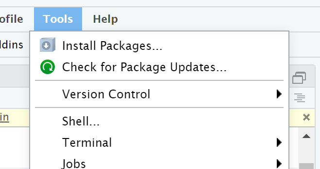


Now that we have installed the packages, and we are using the correct working directory, when we try to connect to the workspace
it is going to ask us to log in.
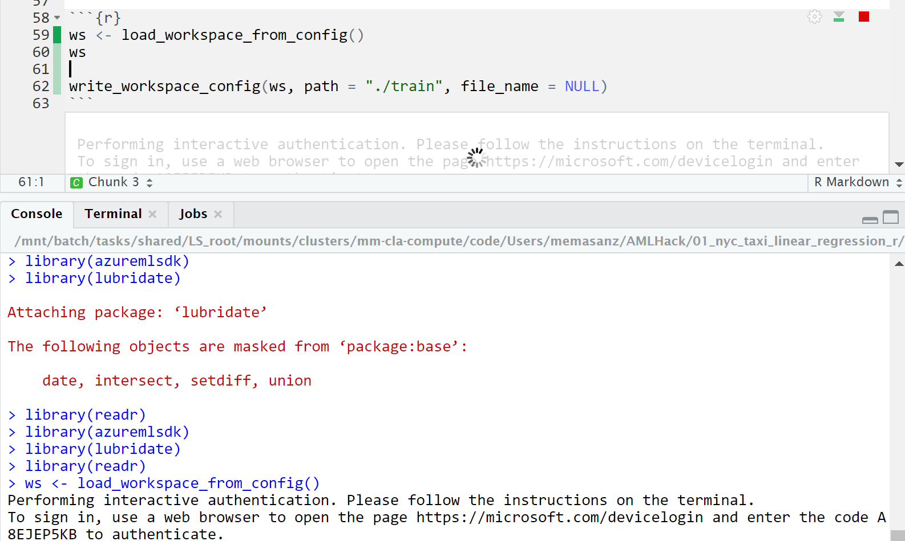

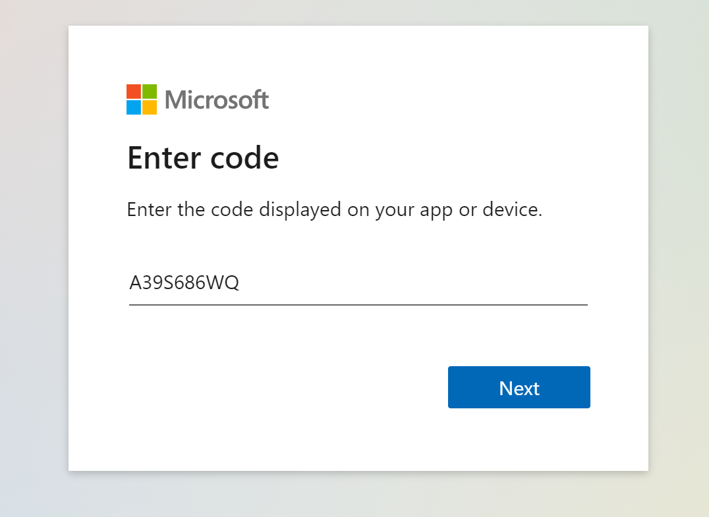

Note the config file was written.  You can see that updated file over in the Azure ML workspace in a folder.  This config file is pretty slick.  It has the configuation information needed to connect into your workspace.  


Creating an experiment. 
Now we will create the experiment.  This is where you can group your various runs together and compare your metrics.


```{r create_experiment}
experiment_name <- paste(username, "taxi-experiment-r", sep = "-") 
exp <- experiment(ws, experiment_name)
```

Clicking on the experiments tab, we will see that a new experiment has been added.


You should see an experiment with your user name.


Creating Compute Cluster

```{r create_cluster}
cluster_name <- paste(username, "rcluster", sep = "") 
compute_target <- get_compute(ws, cluster_name = cluster_name)
if (is.null(compute_target)) {
  vm_size <- "STANDARD_D2_V2" 
  compute_target <- create_aml_compute(workspace = ws,
                                       cluster_name = cluster_name,
                                       vm_size = vm_size,
                                       min_nodes = 1,
                                       max_nodes = 1)
  
  wait_for_provisioning_completion(compute_target, show_output = TRUE)
}
```

### Creating Compute 

https://azure.github.io/azureml-sdk-for-r/reference/create_aml_compute.html

Typically, setting the idle_seconds_before_scaledown is helpful to keep costs down.  For this we are using small machines, and we want to make the best use of time, so that was not set.  Today so we are not waiting on this cluster, we are going to set the min and max cluster size to be 1.  (Typical wait time = 5 minutes)  If we set the min node to be 0 with a idel_seconds_before_scaledown, then the machine is a best practice.  Because we did not do that, we need to rememeber to delete this machine when we are done for the day.

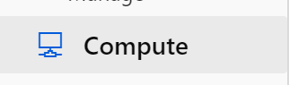

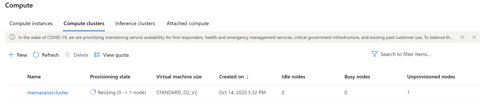

We will see that the creation of the compute completed.

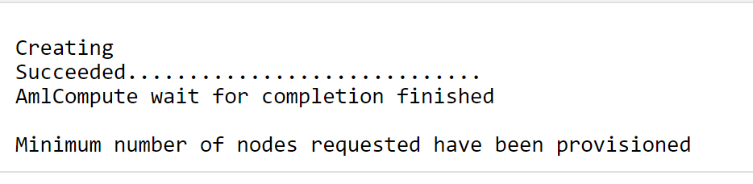

### Working data

Move through notebook as it pulls a dataset in and begins the cleansing process.

After data is cleansed, we will save it to a file.

```{r}
filename <- paste(username, "green-taxi.Rd", sep="-")
file1 <- paste("./train/", filename, sep="")
df$vendorID <- factor(df$vendorID)
df$month_num <- ordered(df$month_num)
df$day_of_month <- ordered(df$day_of_month)
df$day_of_week <- ordered(df$day_of_week)
df$hour_of_day <- ordered(df$hour_of_day)
saveRDS(df, file=file1)

print(file)
```
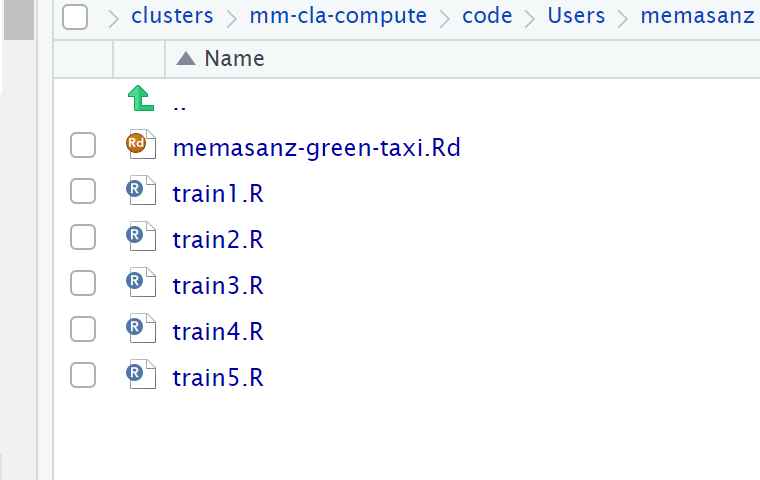

We can save it both as RD and CSV

### Upload Data to datastore.


### Register the Dataset
Registering a dataset provides with traceability to your dataset, and profiling along with code to consume the dataset.
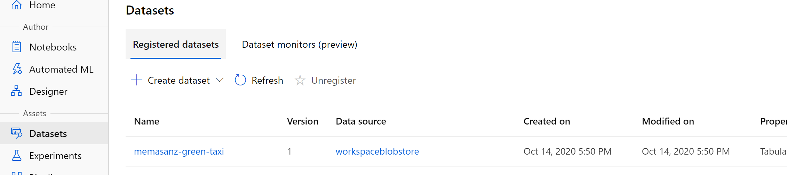

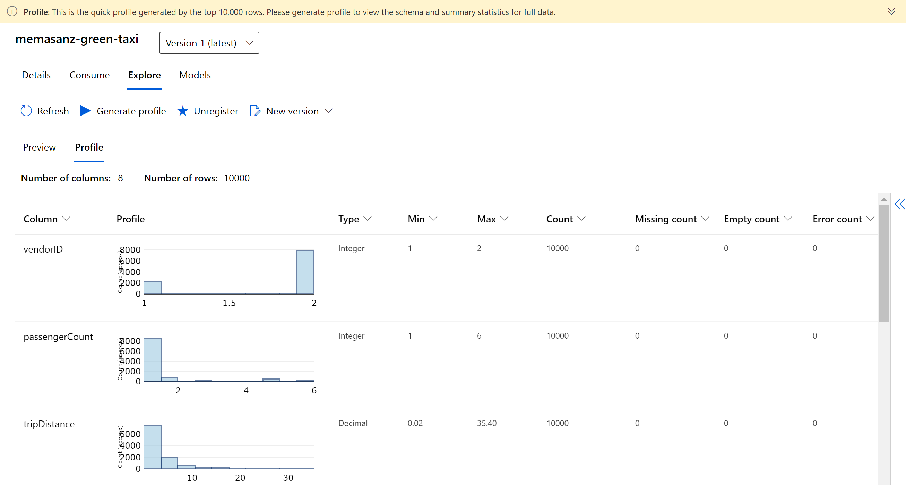


### Create R environment


### Create Estimators

### Submit your job

Go to your experiment, and check out your runs.

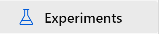

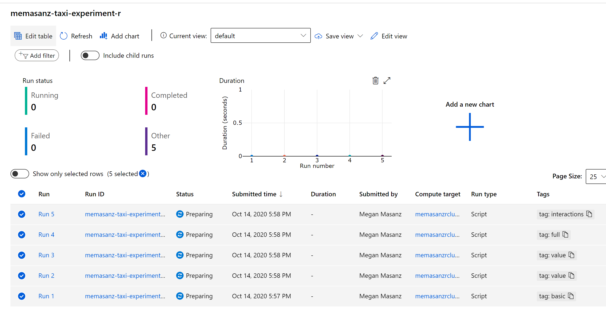

Now that the runs have been submitted, lets discuss what we submitted, and submitted to where? (This will take about 15 minutes to start running)

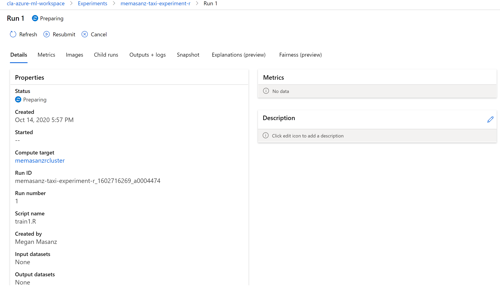

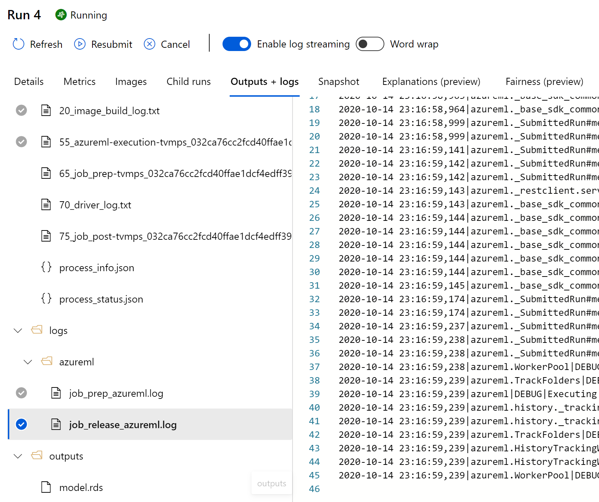

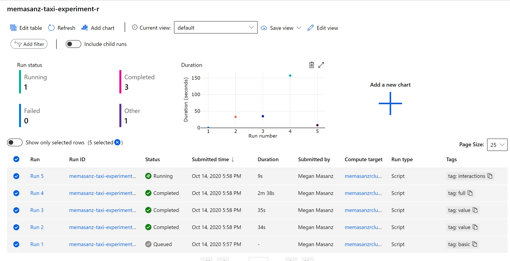

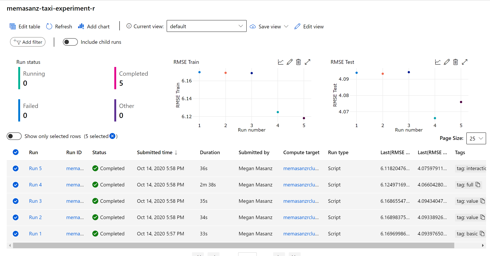

###Deploy as a webservice

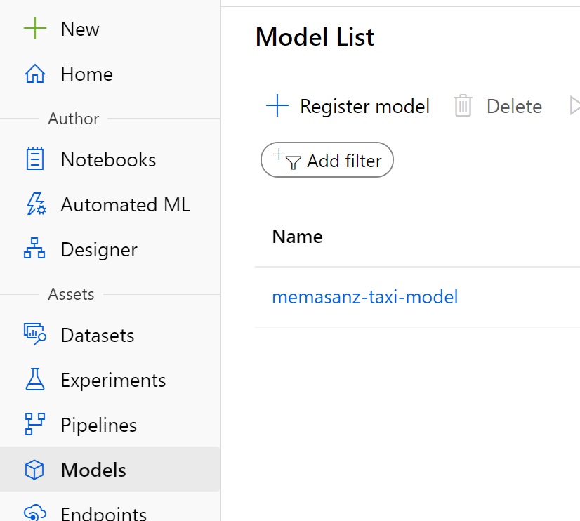

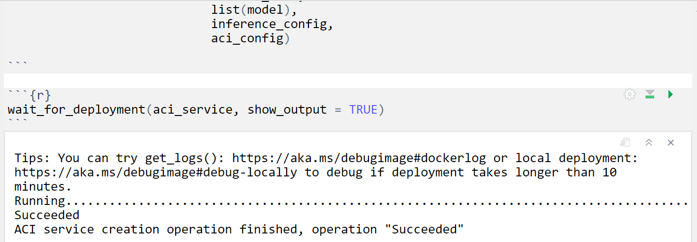


