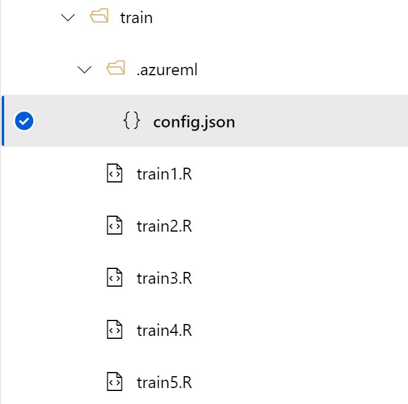
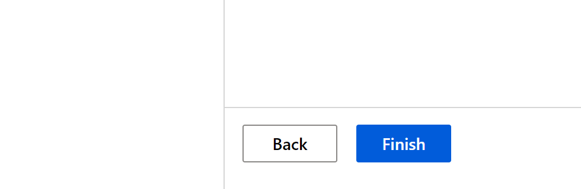
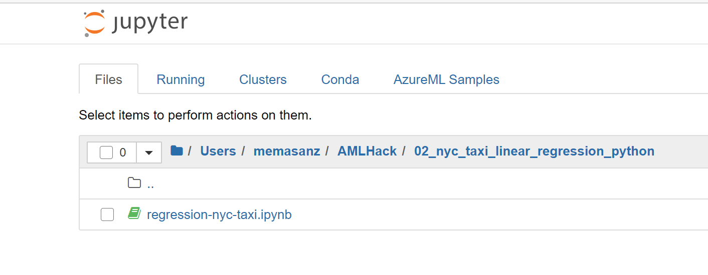

# Azure Machine Learning Hackathon

## Objective:


Objective of this hackathon is to familiarize you with Azure ML looking at a
basic linear regression problem. The first day we will focus on the tools leveraging the Azure ML R SDK. 
On the 2nd day we will move towards using the
python SDK, and look at Auto ML.

The R SDK is in preview, which means it is not intended for production use,
however, this hackathon will provide an introduction into Azure ML leveraging R,
and then applying same concepts in python showcasing AutoML capabilities.

Today we will capture:

1. Connecting to a Workspace
2. Creating a compute instance
3. Cloning notebooks from a github repo
4. Connecting into RStudio
5. Leveraging the R-SDK to:

	* Connect your workspace
	* Load data and prepare for training
	* Upload data to the datastore so it is available for remote training
	* Create a compute resource
	* Train a linear regression model to predict taxi fair
	* Deploy a prediction endpoint
	* Test the model from R


# References:

<https://github.com/Azure/MachineLearningNotebooks/tree/master/how-to-use-azureml>

<https://azure.github.io/azureml-sdk-for-r/reference/index.html>

<https://pypi.org/project/azureml-sdk/>

## Steps after this hackathon:
- Work with your team to setup a dev environment with custom roles based on your
business needs and the roles within your teams.
- Productionizing Code
- Building Azure ML Pipelines

## Day 1 Agenda:   R & Azure ML Workspace 9-2
-----------------------------------

1. Introductions 9-9:30

2. Workspace overview Import Notebook 9:30-10:00

3. Connecting to workspace in RStudio 10:00-10:30

4. Loading Data 10:30-11:00

5. Creating Compute Resources 11:00-11:30

6. *Lunch 11:30-12:30*

7. Training – Experiments & Runs 12:30-1:00

8. Deploying & Testing a model 1:00-2:00

 

## Day 2 Agenda:   Python & AutoML 9-2
-----------------------

1.  Auto ML through Designer 9:00-10:00

2.  Connecting to workspace in Jupyter Notebook, Loading Data, Creating Compute
    Resources 10:00-11:30

3.   *Lunch 11:30-12:30*

4.  Deploying & Testing best model

5.  Training Auto ML Notebook– AutoML

### Let's get started


 


### 1. The Workspace

The workspace is the top-level resource for Azure Machine Learning, providing a centralized place to work with all the artifacts you create when you use Azure Machine Learning. The workspace keeps a history of all training runs, including logs, metrics, output, and a snapshot of your scripts. You use this information to determine which training run produces the best model.

Once you have a model you like, you register it with the workspace. You then use the registered model and scoring scripts to deploy to Azure Container Instances, Azure Kubernetes Service, or to a field-programmable gate array (FPGA) as a REST-based HTTP endpoint. You can also deploy the model to an Azure IoT Edge device as a module.

<https://docs.microsoft.com/en-us/azure/machine-learning/concept-workspace>


 


Heading into the workspace from your URL we can enter the Azure ML Studio.
1.1.  Let’s get into the workspace with the link provided.


Notice the navigation on the left side.


	
### 2. The compute instance.

An Azure Machine Learning compute instance is a managed cloud-based workstation for data scientists.

Compute instances make it easy to get started with Azure Machine Learning development as well as provide management and enterprise readiness capabilities for IT administrators.

Use a compute instance as your fully configured and managed development environment in the cloud for machine learning. They can also be used as a compute target for training and inferencing for development and testing purposes.

<https://docs.microsoft.com/en-us/azure/machine-learning/concept-compute-instance>


Let’s click on the create button.  This step typically will take about 5 minutes to spin up a new compute instance.


After your compute instance is up and rolling, we can connect with git to this repo.  


This hackathon has source code in this repo that we will be leveraging.  Given the nice integration with git found directly in the Azure ML workspace, we can easily clone this repo directly in the workpace.  Head over to the Notebooks section by clicking the `Notebooks` icon.

Let’s get the source files.


If you navigate to the notebooks, we are able to leverage git and clone the
resources which will then be available to our compute cluster.


Click on the git icon and let’s clone our notebooks

```
git clone https://github.com/memasanz/AMLHack.git
```

After cloning, you can click on the refresh icon to ensure you are able to see the repo.


 


Let's go ahead and disconnect from the git repo.  First we need to give ourselves permission to the files/folders.

```
chmod -R 775 AML
```

Now that the notebooks we need are there, let's head over to our compute node.  Note that the R SDK is just that, an SDK- providing extensibility to run your code in a compute instance or your local machine (VSCode Azure ML extension is *tight*).  To keep things simple for today, we are going to leverage the compute nodes within Azure. 


Let's head over to RStudio by clicking on the RStudio hyperlink.


RStudio - up and rolling with the correct version of Azure ML SDK.  Sweet.  Typical house keeping for your session.

1.  **Set your working directory**.

Notebooks and R scripts are stored in the default storage account of your workspace in Azure file share. These files are located under your “User files” directory. This storage makes it easy to share notebooks between compute instances. The storage account also keeps your notebooks safely preserved when you stop or delete a compute instance.

We want to navigate to 

`setwd("/mnt/batch/tasks/shared/LS_root/mounts/clusters/{your computecluster}/code/Users/{your user}/AMLHack/01_nyc_taxi_linear_regression_r")`


2.  Take a look around.  So we have the main R markdown file that we will be leveraging, and there is a folder marked `train` and another marked `deploy`.  These are the scripts that we will leverage for traininging and deploying our models.


3.  Let's run some code. 

Open up the train-and-deploy-taxi-model.Rmd file. The user name - it's a prefix to make us unique in the hackathon. 


```{r}
username <- "memasanz"
```

3.  Notice that for the code snippet loading the libaries, we will need to install those.  The azuremlsdk is already installed for us, but we need to install the lubridate and readr packages on this vm.


```{r}
library(azuremlsdk)
library(lubridate)
library(readr)
```


Now you can run the loading of the libraries

```{r}
library(azuremlsdk)
library(lubridate)
library(readr)
```


Now that we have installed the packages, and we are using the correct working directory, when we try to connect to the workspace
it is going to ask us to log in.


You will head over to <https://microsoft.com/devicelogin> with the code provided inside RStudio.  with the code, careful to copy over the entire code.


So you can paste it into the code box.


Note the commented out code to write a config file.  You can see that updated file over in the Azure ML workspace in a folder.  This config file is pretty slick.  It has the configuation information needed to connect into your workspace if you were to connect from a resource outside of Azure ML - (using a local machine, databricks etc.) 




### 3.  Creating an experiment. 
Now we will create the experiment.  This is where you can group your various runs together and compare your metrics.


```{r create_experiment}
experiment_name <- paste(username, "taxi-experiment-r", sep = "-") 
exp <- experiment(ws, experiment_name)
```

Clicking on the experiments tab, we will see that a new experiment has been added.

 


You should see an experiment with your user name.


### 4. Creating Compute Cluster

A compute target is a designated compute resource or environment where you run your training script or host your service deployment. This location might be your local machine or a cloud-based compute resource. Using compute targets makes it easy for you to later change your compute environment without having to change your code.

In a typical model development lifecycle, you might:

Start by developing and experimenting on a small amount of data. At this stage, use your local environment, such as a local computer or cloud-based virtual machine (VM), as your compute target.
Scale up to larger data, or do distributed training by using one of these training compute targets.
After your model is ready, deploy it to a web hosting environment or IoT device with one of these deployment compute targets.
The compute resources you use for your compute targets are attached to a workspace. Compute resources other than the local machine are shared by users of the workspace.


```{r create_cluster}
cluster_name <- paste(username, "rcluster", sep = "") 
compute_target <- get_compute(ws, cluster_name = cluster_name)
if (is.null(compute_target)) {
  vm_size <- "STANDARD_D2_V2" 
  compute_target <- create_aml_compute(workspace = ws,
                                       cluster_name = cluster_name,
                                       vm_size = vm_size,
                                       min_nodes = 0,
                                       max_nodes = 3,
                                       idle_seconds_before_scaledown = 1500)
  
  wait_for_provisioning_completion(compute_target, show_output = TRUE)
}
```

### 5. Creating Compute 

https://azure.github.io/azureml-sdk-for-r/reference/create_aml_compute.html

Typically, setting the idle_seconds_before_scaledown is helpful to keep costs down.  For this we are using small machines, and we want to make the best use of time, so that was not set.  Today so we are not waiting on this cluster, we are going to set the min and max cluster size to be 1.  (Typical wait time = 5 minutes)  If we set the min node to be 0 with a idel_seconds_before_scaledown, then the machine is a best practice.  Because we did not do that, we need to rememeber to delete this machine when we are done for the day.

 


 


We will see that the creation of the compute completed.

 


### 6. Working data

Move through notebook as it pulls a dataset in and begins the cleansing process.

```{r}
dataset <- create_tabular_dataset_from_parquet_files(path="https://automlsamplenotebookdata.blob.core.windows.net/automl-sample-notebook-data/green_taxi_data.parquet",
                                                validate = TRUE,
                                                include_path = FALSE,
                                                set_column_types = NULL,
                                                partition_format = NULL
)

df <- load_dataset_into_data_frame(dataset,on_error = "null",out_of_range_datetime = "null")
```


After data is cleansed, we will save it to a file.  We can save it to an Rd file as well as to a csv file.


```{r}
filename <- paste(username, "green-taxi.Rd", sep="-")
file1 <- paste("./train/", filename, sep="")
df$vendorID <- factor(df$vendorID)
df$month_num <- ordered(df$month_num)
df$day_of_month <- ordered(df$day_of_month)
df$day_of_week <- ordered(df$day_of_week)
df$hour_of_day <- ordered(df$hour_of_day)
saveRDS(df, file=file1)

print(file)
```


We can save it both as RD and CSV (look inside the train folder and you will see the datasets have been saved).

Recall that the files are saved from our folder to a file share in Azure.


### 7. Upload Data to datastore.


### 8. Register the Dataset
Registering a dataset provides with traceability to your dataset, and profiling along with code to consume the dataset.

Azure Machine Learning datasets aren't copies of your data. By creating a dataset, you create a reference to the data in its storage service, along with a copy of its metadata.

Because datasets are lazily evaluated, and the data remains in its existing location, you

Incur no extra storage cost.
Don't risk unintentionally changing your original data sources.
Improve ML workflow performance speeds.
To interact with your data in storage, create a dataset to package your data into a consumable object for machine learning tasks. Register the dataset to your workspace to share and reuse it across different experiments without data ingestion complexities.

Datasets can be created from local files, public urls, Azure Open Datasets, or Azure storage services via datastores.

There are 2 types of datasets:

A FileDataset references single or multiple files in your datastores or public URLs. If your data is already cleansed and ready to use in training experiments, you can download or mount files referenced by FileDatasets to your compute target.

A TabularDataset represents data in a tabular format by parsing the provided file or list of files. You can load a TabularDataset into a pandas or Spark DataFrame for further manipulation and cleansing. For a complete list of data formats you can create TabularDatasets from, see the TabularDatasetFactory class.

Additional datasets capabilities can be found in the following documentation:

[Version and track dataset lineage](https://docs.microsoft.com/en-us/azure/machine-learning/how-to-version-track-datasets).

[Monitor your dataset to help with data drift detection](https://docs.microsoft.com/en-us/azure/machine-learning/how-to-monitor-datasets).


 


Head over to the workspace and check out the `Explore` tab on your dataset to look at the profile that was generated.

 


### 9. Create R environment

```{r create_environment}

pkg1 <- cran_package("lubridate")
pkg2 <- cran_package("optparse")
env <- r_environment(name = "r_env",
                     cran_packages = list(pkg1, pkg2))
```

### 10. Create Estimators/Script Run Config

<https://docs.microsoft.com/en-us/azure/machine-learning/how-to-set-up-training-targets>

When training, it is common to start on your local computer, and then later scale out to a cloud-based cluster. With Azure Machine Learning, you can run your script on various compute targets without having to change your training script.

All you need to do is define the environment for each compute target within a script run configuration. Then, when you want to run your training experiment on a different compute target, specify the run configuration for that compute.


### 11. Submit your job

Submitted the run will submit to the experiment the training of a the model.  

Go to your experiment, and check out your runs.


Now that the runs have been submitted, lets discuss what we submitted, and submitted to where? (This will take about 15 minutes to start running)

 


 


 


 


After the runs have completed, we can review the metrics & pull out the best run based on the metric that we would like to look at.  In the training script, metrics are logged leveraging the R SDK as shown below.

```{r}
log_metric_to_run("R^2", summary(mod)$r.squared)
```

Note at the end of the training script, the output model is saved to the outputs folder, which we can see for  a given run in the Azure ML workspace.

```{r}
runs <- c(run1, run2, run3, run4, run5)
best_rsquared = 0.0

for (run in runs) {
   metrics = get_run_metrics(run)
   val = metrics$`R^2`
   if (is.null(val) == FALSE){
     if (val > best_rsquared){
       best_run = run
       best_rsquared = val
     }
   }
}

print(get_run_metrics(best_run))
```

Notice the number of nodes that we use during our training goes up.

 


### 12. Deploy as a webservice

### 13. Register the Model

A registered model is a logical container for one or more files that make up your model. For example, if you have a model that's stored in multiple files, you can register them as a single model in the workspace. After you register the files, you can then download or deploy the registered model and receive all the files that you registered.

You need to define the **inference config**. An inference configuration describes how to set up the web-service containing your model. It's used later, when you deploy the model.

In it you define an entry script

The **entry script** receives data submitted to a deployed web service and passes it to the model. It then takes the response returned by the model and returns that to the client. The script is specific to your model. It must understand the data that the model expects and returns.

The two things you need to accomplish in your entry script are:

Loading your model (using a function called **init()**)
Running your model on input data (using a function called **run()**)
Let's go through these steps in detail.


# Day 2

Today's objective is to tie what was done with R, into leveraging the python SDK.  We also want to show case AutoML, as we lean into python, and are now comfortable with the Azure ML Workspace, we can establish an deploy models straight from the portal.  There are 2 main modules we want to get through today.  AutoML and our linear regression notebook.


### 1. AutoML

Automated machine learning is a process in which the best machine learning algorithm to use for your specific data is selected for you.

When to use AutoML: classify, regression, & forecast

<https://docs.microsoft.com/en-us/azure/machine-learning/concept-automated-ml>

Note there is automatic featurization based on your task

<https://docs.microsoft.com/en-us/azure/machine-learning/how-to-configure-auto-features#featurization>


Click on the Auto ML Icon.


Click on `New Automated ML Run` link


Note here we can select one of our saved datasets, which is awesome.  The file format for the open dataset we were using was parquet, we can programmatically convert from parquet to a tabular datasets, but that means that we should not select the OpenDataset, but rather use one of our registered datasets.


Click on the regression option.


Note you can select the primary metric for selecting the `best model`


Checking the check box for explaining the model will provide lots of information regarding *why* a model was selected.

<https://docs.microsoft.com/en-us/azure/machine-learning/how-to-machine-learning-interpretability-aml>

You can block models from running


You can specify validation


You can also specificy featurization of the data, and select the columns.


Clicking finish will being the runs.


The experiment will run for ~1 hour to go through the models


 

Clicking on the Run/RunId will let us see the 


 


Clicking on the winning model will provide the option to deploy, as well as checking out the child runs.


**We will come back to this thread after the 30 minutes.**

### 2. Linear Regression leveraging the python SDK.

In your Azure ML Workspace head over to your compute node, and select the jupyter notebook experience.


Now you are in jupyter notebook experience


Let's head over to the linear regression notebook.



As we updated the user for the R markdown file yesturday, let's update the user here.


Build features based on python library just as we did with R.


Cleanse the data (Note this is a little different than what we did in the R notebook - if you wanted to the exact same results, that would be why you would leverage a **registered dataset**)


Be sure to go back into Azure ML Workspace and review your registered dataset.  The screen shot below is a reminder to go and grab that code directly from Azure ML Workspace.


Note that even though the auto ml job is running, we will be able to run the linear regression experiment on our machine.


Note in the **training** script, we used the Sklearn.pipeline.  R does a great job of handling the categorical variables, with python, if we used the pandas dataframe get_dummies, we would be trasforming the dataset, and thus transforming what would be expected as inputs to the model.  This would mean that the REST API would expect dummy variables, which from an end user perspective, would not be ideal.

Sklearn.pipeline is a Python implementation of ML pipeline. Instead of going through the model fitting and data transformation steps for the training and test datasets separately, you can use Sklearn.pipeline to automate these steps. Here is a diagram representing a pipeline for training a machine learning model based on supervised learning.

Note the metrics are based on what we selected in the training script, just like with the R SDK.


The score script is the same concept as was seen with the predict.R script.  Note in the score.py file we leverage the 
**inference_schema** library which makes the swagger avaialable to our REST end point.

Also note that the authentication was set to true.  This means that ACI will require a key.


```
{"swagger": "2.0", "info": {"title": "memasanz-python-regression-srv", "description": "API specification for the Azure Machine Learning service memasanz-python-regression-srv", "version": "1.0"}, "schemes": ["https"], "consumes": ["application/json"], "produces": ["application/json"], "securityDefinitions": {"Bearer": {"type": "apiKey", "name": "Authorization", "in": "header", "description": "For example: Bearer abc123"}}, "paths": {"/": {"get": {"operationId": "ServiceHealthCheck", "description": "Simple health check endpoint to ensure the service is up at any given point.", "responses": {"200": {"description": "If service is up and running, this response will be returned with the content 'Healthy'", "schema": {"type": "string"}, "examples": {"application/json": "Healthy"}}, "default": {"description": "The service failed to execute due to an error.", "schema": {"$ref": "#/definitions/ErrorResponse"}}}}}, "/score": {"post": {"operationId": "RunMLService", "description": "Run web service's model and get the prediction output", "security": [{"Bearer": []}], "parameters": [{"name": "serviceInputPayload", "in": "body", "description": "The input payload for executing the real-time machine learning service.", "schema": {"$ref": "#/definitions/ServiceInput"}}], "responses": {"200": {"description": "The service processed the input correctly and provided a result prediction, if applicable.", "schema": {"$ref": "#/definitions/ServiceOutput"}}, "default": {"description": "The service failed to execute due to an error.", "schema": {"$ref": "#/definitions/ErrorResponse"}}}}}}, "definitions": {"ServiceInput": {"type": "object", "properties": {"data": {"type": "array", "items": {"type": "object"}}}, "example": {"data": [{"vendorID": "1", "passengerCount": 1, "tripDistance": 4.2, "month_num": "1", "day_of_month": "4", "day_of_week": "1", "hour_of_day": "18"}]}}, "ServiceOutput": {"type": "array", "items": {"type": "object"}, "example": [18.2281]}, "ErrorResponse": {"type": "object", "properties": {"status_code": {"type": "integer", "format": "int32"}, "message": {"type": "string"}}}}}
```

<https://editor.swagger.io/>


